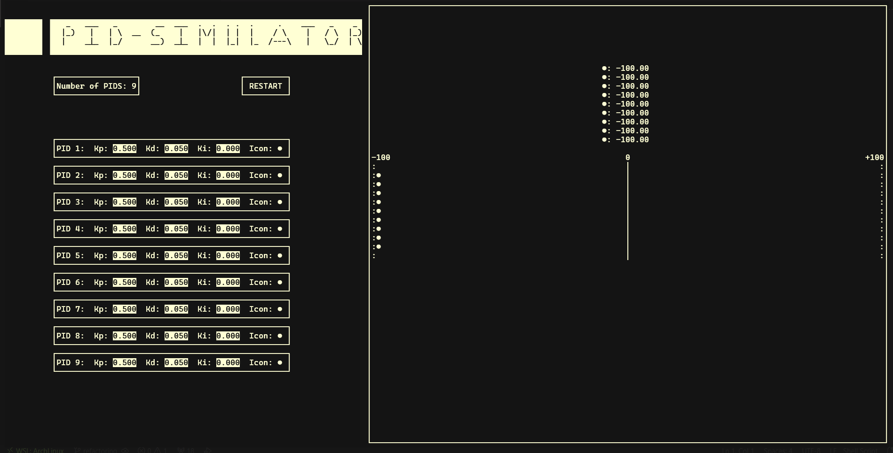

# PID - Simulator

Its a terminal interface for testing diferent configurations of PIDs controllers.
It was originaly plained to run in a windows terminal using arch wsl, but as it only uses curses
builting library of python for Unix systems, it probably runs in any modern terminal if you are using a linux.
I din't tested in a windows system with windows-curses.

## Running

To run the program use one of the toold inside `./tools/` directory:

```zsh
./tools/run.sh
```

Will clean the `src` files and run the program at the end exclude the `./out/` python
files.

```zsh
./tools/build.sh
```

Will clean the `src` files end exit, is usef to debug the program. To run type: `python ./out/gui.py`

The reason for that is you can't import `curses._CursesWindow` so when you are using wrapper vscode and my neovim
wasn't eable to recognize the `stdscr` as a instance of `_CursesWindow` so they wasn't show the curses methods.
So I made the cleaner that removes any trace of `_CursesWindow` in the source files, so it can be executed.

## Usage



* Use the arrows to navigate in the interface.
* Press `p` or `space` to pause and resume the simulation
* Press `enter`, `backspace` or `insert` to edit a label or to restar the simulation on the restart button.
* The current locate of the cursor if represented by the blink of the label.
* Press `enter` to confirm the label after editing it.
* Press `q` to exit, ending the program.

Tips:

* You can change a label while runing the simulation, this will pause the simulation.
* If you leave the label empty the label will fill with the default value.
* You can use wild character in icon label, but using emotes will crash, still beeing solved.

## How to Edit Assets

See the docs at: [How to craete asets](./documents/How%20to%20create%20assets.md)

## Why no tests?

Because I have no idea how to use pytest with it. I actualy thing pytest can't handle it, so I should be using pyautogui
but as it is a simple project I've just skiped this.
